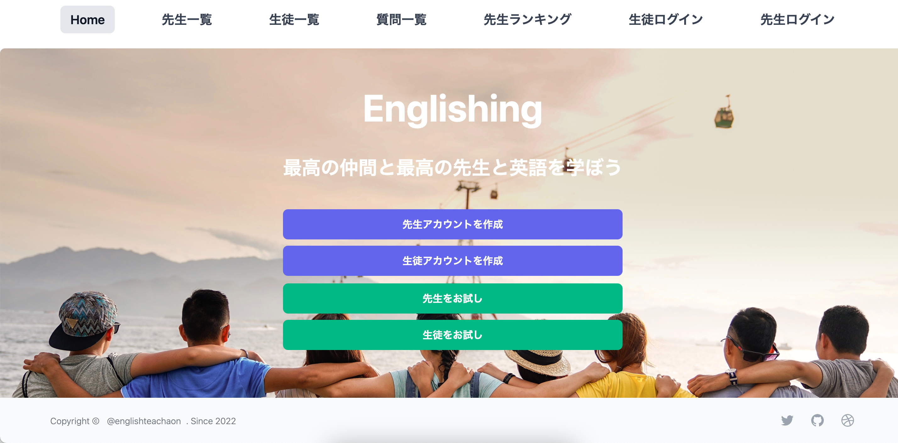

# Englishing

学ぶ上で大切なのは、分からないことを分からないままにしないことです。

英語も同じです。

このサイトは、生徒が英語を学ぶ上で分からないことを質問し、それを分かりやすく教えてくれる先生に出会ってほしい。

そして、英語を好きになってほしいという思いで作成しました。

学校や塾とは違い、いつでも気軽に質問できるということが大きなメリットです。
将来は指定した英語資格や検定を持った人しか先生登録することができないようにしていきたいと考えています。

# 使用技術
* Ruby 3.1.1

* Ruby on Rials 6.0.5.1

* MySQL　8.0.30

* Rspec

# 機能一覧
* ログインログアウト(devise)

* 回答機能

* 検索機能(ransack)

* いいね(Ajax)

* フォロー、アンフォロー(Ajax)

* 画像投稿機能

* ベストアンサー機能

* 星レビュー機能

* ランキング機能

* 通知機能

* チャット機能

* ページネーション機能(kaminari)

# テスト　
Rspec

* 単体テスト(model)

* 機能テスト(request)

* 統合テスト(system)
